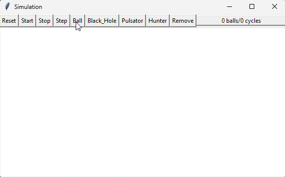

## About

This program simulates 'simultons'. A Simulton is an abstract base class that is inherited by all other objects. There are two types of simultons, predator simultons and prey simultons. Predator simultons 'eat' prey simultons when they come into contact. Users can add or remove simultons at any point in the simulation. The simulation can be run continuously at a rate of 50 cycles per second or can be stepped through one cycle at a time.

    

## Simulton Types

| Simulton   | Properties                                                                                                                                                              |
| ---------- | ----------------------------------------------------------------------------------------------------------------------------------------------------------------------- |
| Ball       | Represents a ball traveling in a straight line with a random initial direction. A ball is a prey and can be eaten by any predator.                                      |
| Black Hole | Represents a stationary object that 'eats' any prey object whose center becomes contained its perimeter.                                                                |
| Pulsator   | Represents a special kind of Black Hole that gets bigger as it eats prey and smaller as it starves. If a Pulsator gets too small it removes itself from the simulation. |
| Hunter     | Represents a special kind of Pulsator that is mobile like a Ball and hunts (moves towards) its closest prey.                                                            | 

## How to Run

- `python main.py`